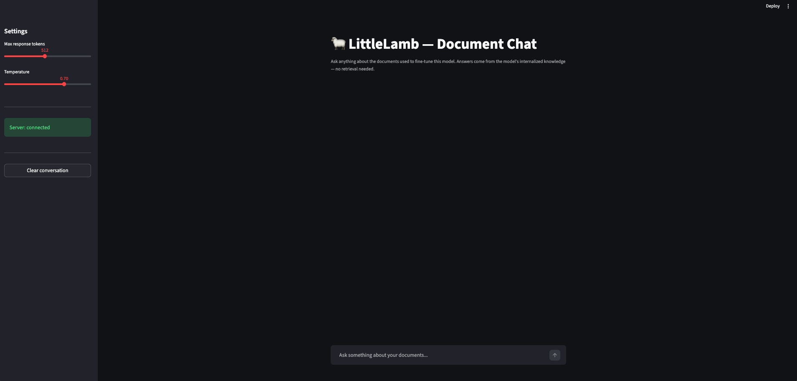

# LittleLamb Fine-Tuning — No-RAG Document Intelligence

Fine-tune the [LittleLamb](https://huggingface.co/MultiverseComputingCAI/LittleLamb) language model on your own PDF documents and chat with it locally — no vector databases, no retrieval pipelines, no cloud.



---

## The Problem with RAG for Small Document Sets

Retrieval-Augmented Generation (RAG) is the standard answer to "how do I make an LLM answer questions about my documents?" It works well at scale, but for small document collections it carries a disproportionate infrastructure cost:

- A **vector database** (Chroma, Pinecone, Weaviate…)
- An **embedding model** to convert text to vectors
- A **chunking and indexing pipeline**
- A **retrieval step** that must find the right chunks at query time
- A **reranking step** to sort results by relevance
- **Prompt engineering** to inject retrieved context without overwhelming the context window

All of this before writing a single line of actual application logic.

## The Alternative: Just Fine-Tune a Small Model

For collections of a few to a few dozen PDFs, there is a simpler path: **teach the model the content directly**, the same way a human reads and memorises a textbook. After fine-tuning, the knowledge lives in the model weights. At inference time there is no retrieval — the model already knows the answers.

This approach works especially well when:

- Your document set is **stable** (not updated daily)
- You have **fewer than ~50 dense documents**
- You want a **completely local, offline** solution
- You prefer simplicity over retrieval precision

This is where **LittleLamb** comes in — a model developed by [Multiverse Computing](https://multiversecomputing.com), a quantum and AI company specialised in efficient model compression. LittleLamb is a 290M-parameter model built by compressing Qwen3-0.6B by 50% using their proprietary CompactifAI technology. At its parameter count, it is **current state of the art**: it consistently outperforms models of similar or even larger size on standard benchmarks, while being small enough to run entirely on a laptop CPU — no GPU, no cloud, no subscription. It is, today, one of the best models you can run locally with so few parameters.

> **Note:** English documents yield better results. The model is bilingual (English/Spanish), but its strongest performance is in English.

---

## Architecture

```
documents/          ← put your PDFs here
    my_report.pdf
    manual.pdf

outputs/
    dataset/
        raw_text/   ← extracted text per document (JSON)
        raw_images/ ← images extracted from PDFs
        train.jsonl ← training dataset
    model/          ← LoRA adapter weights after fine-tuning

src/
    pdf_processor.py    ← step 1: extract text + images from PDFs
    image_processor.py  ← Claude API image-to-text (optional)
    dataset_builder.py  ← step 2: build training dataset
    trainer.py          ← step 3: LoRA fine-tuning
    server.py           ← step 4: local inference API (FastAPI)
    chat_app.py         ← step 5: Streamlit chat UI
```

---

## Requirements

- Python 3.10+
- ~2 GB of free RAM (the base model is ~1.2 GB in float32)
- **No GPU required** — everything runs on CPU. A GPU will make training significantly faster if available; the code detects it automatically.
- Internet connection on first run (to download the model from Hugging Face)

---

## Setup

```bash
# Clone the repo
git clone <this-repo>
cd custom-llm-finetuning

# Create and activate a virtual environment
python -m venv .venv
source .venv/bin/activate   # Windows: .venv\Scripts\activate

# Install dependencies
pip install -r requirements.txt

# Copy the environment template
cp .env.example .env
# Edit .env and fill in your settings (see Configuration section)
```

---

## Usage

### 1 — Add your documents

Copy your PDF files into the `documents/` folder:

```
documents/
    annual_report_2024.pdf
    product_manual.pdf
    research_paper.pdf
```

### 2 — Extract text and images from PDFs

```bash
python src/pdf_processor.py
```

This reads every PDF in `documents/`, extracts text page by page, and optionally describes embedded images using Claude (if `ANTHROPIC_API_KEY` is set). Results are saved to `outputs/dataset/raw_text/`.

### 3 — Build the training dataset

```bash
python src/dataset_builder.py
```

Two modes are available:

| Mode | When it activates | Description |
|------|-------------------|-------------|
| `qa` | `ANTHROPIC_API_KEY` is set | Claude generates question-answer pairs from each text chunk. Produces a dataset highly suited for a chat interface. **Recommended.** |
| `chunks` | No API key / explicit `--mode chunks` | Wraps text chunks directly as training examples. Fully offline. Simpler but less chat-friendly. |

You can force a mode:

```bash
python src/dataset_builder.py --mode qa            # force Q&A mode
python src/dataset_builder.py --mode qa --n-questions 8  # 8 Q&A pairs per chunk
python src/dataset_builder.py --mode chunks        # force chunks mode
```

### 4 — Fine-tune

```bash
python src/trainer.py
```

This downloads LittleLamb from Hugging Face (first run only), applies LoRA, and trains for the configured number of epochs. Adapter weights are saved to `outputs/model/`.

**Expected training times on CPU (rough estimates):**

| Examples in dataset | Epochs | Approximate time |
|--------------------|--------|-----------------|
| 100 | 3 | 20–40 min |
| 500 | 3 | 2–4 hours |
| 1000 | 3 | 4–8 hours |

On a CUDA GPU, divide by roughly 10–20x.

### 5 — Start the inference server

```bash
python src/server.py
```

The server loads the base model, merges the LoRA adapters, and starts a FastAPI server at `http://localhost:8000`. The endpoint is OpenAI-compatible (`/v1/chat/completions`).

### 6 — Open the chat UI

In a **separate terminal**:

```bash
streamlit run src/chat_app.py
```

Your browser will open at `http://localhost:8501` with a chat interface. Ask anything about the documents you used for fine-tuning.

---

## Configuration (`.env`)

| Variable | Default | Description |
|----------|---------|-------------|
| `ANTHROPIC_API_KEY` | *(empty)* | Anthropic API key. Required for image processing and Q&A dataset generation. |
| `ANTHROPIC_MODEL` | `claude-sonnet-4-6` | Claude model to use. Any Claude model works; see [Anthropic docs](https://docs.anthropic.com) for options. |
| `FINETUNE_EPOCHS` | `3` | Number of training passes over the dataset. |
| `FINETUNE_BATCH_SIZE` | `2` | Examples per gradient step. Reduce to `1` if you run out of memory. |
| `FINETUNE_LORA_RANK` | `16` | LoRA rank. Higher = more expressive but slower. `8`–`32` is typical. |
| `FINETUNE_MAX_SEQ_LEN` | `512` | Maximum token length per training example. |
| `FINETUNE_LEARNING_RATE` | `2e-4` | Optimizer learning rate. |
| `SERVER_HOST` | `0.0.0.0` | Host for the inference server. |
| `SERVER_PORT` | `8000` | Port for the inference server. |

---

## Image Processing

When PDFs contain embedded images (photos, diagrams, charts, scanned pages), raw text extraction misses that content. This project handles images via **Claude Vision**:

- If `ANTHROPIC_API_KEY` is set, each image is sent to Claude, which returns a detailed text description. That description is included in the training data as if it were regular text.
- If the key is **not set**, images are silently skipped and only the text content is used.

This means a scanned-only PDF with no selectable text and no API key will produce an empty dataset — set the key if your documents are image-heavy.

---

## Limitations

- **Not for large document sets.** Beyond ~50 dense documents, the model's capacity becomes a bottleneck and RAG starts making more sense.
- **Small model, imperfect recall.** LittleLamb has 290M parameters. It will learn the domain well but may occasionally confuse details or generate plausible-sounding but inaccurate answers. Always verify critical information against the source documents.
- **Static knowledge.** If your documents change frequently, you need to re-run the full pipeline (steps 2–4). For highly dynamic sources, RAG is the better tool.
- **CPU training is slow.** See the time estimates table above. This is acceptable for a one-off fine-tuning session; it is not designed for continuous retraining.
- **Language.** English documents produce the best results. Spanish is also supported by the base model but fine-tuning quality may be lower for other languages.

---

## Project Philosophy

This repository exists because most document Q&A problems are smaller than the solutions commonly proposed for them. RAG is powerful — but it is also complex, stateful, and operationally heavy. For the common case of "I have a handful of PDFs and I want to ask questions about them", the right answer is often: just fine-tune a small model and be done with it.

### Why LittleLamb

[LittleLamb](https://huggingface.co/MultiverseComputingCAI/LittleLamb) is developed by [Multiverse Computing](https://multiversecomputing.com), a company at the intersection of quantum computing and AI that specialises in making powerful models run efficiently on constrained hardware. Their CompactifAI compression technology reduces Qwen3-0.6B to 290M parameters with minimal performance loss — a feat that goes well beyond standard quantisation.

At the time of writing, LittleLamb is **state of the art for its size class**. It is one of the best-performing models that can run comfortably on a consumer CPU, outperforming other sub-500M models on reasoning, instruction-following, and bilingual (English/Spanish) tasks. Choosing it for this project is a deliberate decision: it represents the highest possible quality bar for a fully local, zero-infrastructure fine-tuning setup.

In practical terms this means:
- **No GPU required** — it fits and runs in standard laptop RAM
- **Modern chat template** (Qwen3/ChatML) — fine-tunes cleanly with LoRA
- **Apache 2.0 license** — use it for any purpose, commercial or otherwise
- **Bilingual** — works with both English and Spanish documents

---

## License

Apache 2.0 — same as the LittleLamb model itself.
